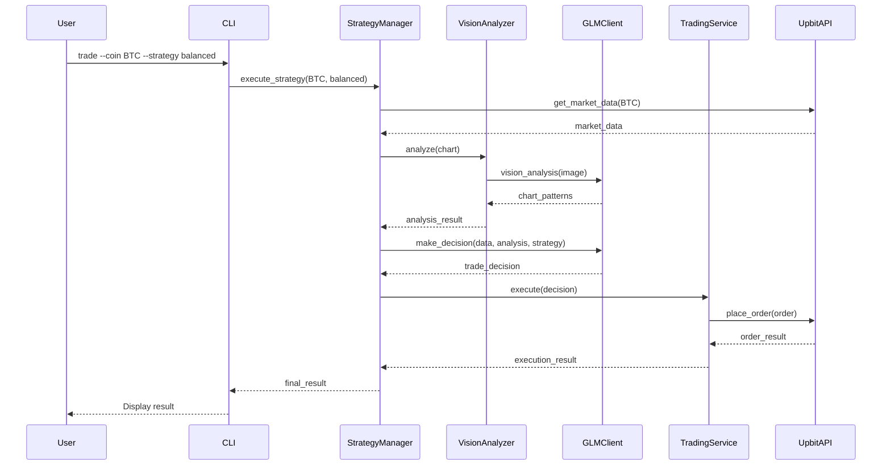
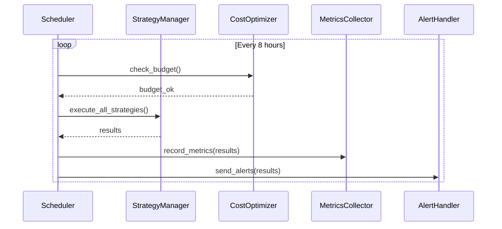

# GPT Bitcoin 시스템 아키텍처 개요

## 시스템 개요

GPT Bitcoin은 GLM-4.6 기반 AI 자동매매 시스템으로, Domain-Driven Design (DDD) 아키텍처를 기반으로 구현되었습니다. 이 시스템은 다중 코인 지원, 실시간 모니터링, 비용 최적화, 고급 보안 기능을 제공합니다.

## 핵심 아키텍처 원칙

### 1. Domain-Driven Design (DDD)

시스템은 4계층 아키텍처를 따릅니다:

- **Domain Layer**: 비즈니스 로직과 도메인 모델
- **Application Layer**: 유스케이스 조정 및 워크플로우
- **Infrastructure Layer**: 외부 시스템 연결 및 기술 구현
- **Presentation Layer**: 사용자 인터페이스 및 API

### 2. 의존성 주입 (Dependency Injection)

모든 컴포넌트는 인터페이스에 의존하며, 구현은 런타임에 주입됩니다. 이는 테스트 가능성과 유연성을 높입니다.

### 3. 단일 책임 원칙 (Single Responsibility Principle)

각 컴포넌트는 명확한 하나의 책임만 가지며, 변경 사항이 다른 부분에 영향을 최소화합니다.

## 도메인 모델

### 핵심 도메인

#### 1. Trading (거래)

거래의 핵심 로직과 상태를 관리합니다.

```python
# 거래 상태
class TradingState(Enum):
    IDLE = "idle"
    ANALYZING = "analyzing"
    TRADING = "trading"
    ERROR = "error"

# 거래 모델
class Trade:
    id: str
    coin: str
    action: TradeAction  # BUY, SELL, HOLD
    amount: Decimal
    price: Decimal
    timestamp: datetime
    status: TradeStatus
```

**주요 기능**:
- 매수/매도/홀드 결정
- 거래 실행 및 상태 추적
- 포트폴리오 관리

#### 2. Cryptocurrency (암호화폐)

다중 코인 지원을 위한 추상화 계층입니다.

```python
class Cryptocurrency(ABC):
    symbol: str
    name: str
    decimal_places: int

    @abstractmethod
    def get_market_data(self) -> MarketData:
        pass

# 구현 예시
class Bitcoin(Cryptocurrency):
    symbol = "BTC"
    name = "Bitcoin"
    decimal_places = 8

class Ethereum(Cryptocurrency):
    symbol = "ETH"
    name = "Ethereum"
    decimal_places = 18
```

**주요 기능**:
- 코인별 시장 데이터 수집
- 통합 인터페이스 제공
- 확장 가능한 코인 지원

#### 3. Security (보안)

API 보안 및 인증을 관리합니다.

```python
class SecurityManager:
    def validate_api_request(self, request: APIRequest) -> bool:
        # 요청 검증 로직
        pass

    def encrypt_sensitive_data(self, data: str) -> str:
        # 데이터 암호화
        pass
```

**주요 기능**:
- API 요청 검증
- 민감 데이터 암호화
- 접근 제어 관리

#### 4. Audit (감사)

모든 거래 및 시스템 이벤트를 기록합니다.

```python
class AuditLog:
    timestamp: datetime
    event_type: str
    user_id: str
    details: dict
    severity: AuditSeverity
```

**주요 기능**:
- 거래 내역 기록
- 시스템 이벤트 로깅
- 규정 준수 보고

## 애플리케이션 계층

### StrategyManager

전략 실행을 관리하는 코디네이터입니다.

```python
class StrategyManager:
    def __init__(
        self,
        trading_service: TradingService,
        glm_client: GLMClient,
        vision_analyzer: VisionAnalyzer
    ):
        self.trading_service = trading_service
        self.glm_client = glm_client
        self.vision_analyzer = vision_analyzer

    async def execute_strategy(
        self,
        coin: str,
        strategy: StrategyType
    ) -> TradeDecision:
        # 1. 시장 데이터 수집
        market_data = await self.collect_market_data(coin)

        # 2. 차트 분석
        chart_analysis = await self.vision_analyzer.analyze(
            market_data.chart
        )

        # 3. GLM 의사결정
        decision = await self.glm_client.make_decision(
            market_data,
            chart_analysis,
            strategy
        )

        # 4. 거래 실행
        return await self.trading_service.execute(decision)
```

### Scheduler

자동화된 거래 실행을 관리합니다.

```python
class TradingScheduler:
    def __init__(
        self,
        strategy_manager: StrategyManager,
        interval: timedelta = timedelta(hours=8)
    ):
        self.strategy_manager = strategy_manager
        self.interval = interval

    async def start(self):
        while True:
            try:
                # 스케줄된 거래 실행
                await self.execute_scheduled_trades()

                # 다음 실행까지 대기
                await asyncio.sleep(self.interval.total_seconds())

            except Exception as e:
                logger.error(f"Scheduler error: {e}")
                # 에러 복구 로직
```

### CostOptimization

API 비용을 추적하고 최적화합니다.

```python
class CostOptimizer:
    def __init__(self, budget_limit: Decimal):
        self.budget_limit = budget_limit
        self.daily_cost = Decimal(0)

    def should_proceed(self, estimated_cost: Decimal) -> bool:
        """예산 초과 여부 확인"""
        return (self.daily_cost + estimated_cost) <= self.budget_limit

    def track_cost(self, api_call: APICall):
        """비용 기록"""
        self.daily_cost += api_call.cost
```

## 인프라 계층

### GLMClient

GLM API와의 통합을 담당합니다.

```python
class GLMClient:
    def __init__(self, api_key: str):
        self.api_key = api_key
        self.base_url = "https://api.glm.ai/v1"

    async def chat_completion(
        self,
        messages: List[Message],
        model: str = "glm-4.6"
    ) -> CompletionResponse:
        # API 호출 구현
        pass

    async def vision_analysis(
        self,
        image: bytes
    ) -> VisionResponse:
        # 비전 분석 구현
        pass
```

### Observability

메트릭 수집 및 추적을 담당합니다.

```python
class MetricsCollector:
    def __init__(self, prometheus_registry: Registry):
        self.registry = prometheus_registry

        # 메트릭 정의
        self.trade_counter = Counter(
            'trades_total',
            'Total number of trades',
            ['coin', 'action']
        )

        self.api_duration = Histogram(
            'api_duration_seconds',
            'API call duration',
            ['endpoint']
        )

    def record_trade(self, coin: str, action: str):
        self.trade_counter.labels(coin=coin, action=action).inc()

    def record_api_call(self, endpoint: str, duration: float):
        self.api_duration.labels(endpoint=endpoint).observe(duration)
```

### Persistence

데이터베이스 리포지토리 구현입니다.

```python
class TradeRepository(ABC):
    @abstractmethod
    async def save(self, trade: Trade) -> None:
        pass

    @abstractmethod
    async def find_by_id(self, trade_id: str) -> Optional[Trade]:
        pass

    @abstractmethod
    async def find_by_coin(
        self,
        coin: str,
        start_date: datetime,
        end_date: datetime
    ) -> List[Trade]:
        pass
```

## 프레젠테이션 계층

### CLI Interface

명령줄 인터페이스를 제공합니다.

```python
@app.command()
def trade(
    coin: str = typer.Option(..., help="코인 심볼 (BTC, ETH)"),
    strategy: str = typer.Option(..., help="전략 유형"),
    testnet: bool = typer.Option(False, help="테스트넷 모드")
):
    """단일 거래 실행"""
    config = load_config()
    container = init_container(config)

    manager = container.strategy_manager()
    decision = asyncio.run(manager.execute_strategy(coin, strategy))

    typer.echo(f"결정: {decision.action}")
    typer.echo(f"금액: {decision.amount}")
    typer.echo(f"가격: {decision.price}")
```

### Alert Handlers

알림 처리를 담당합니다.

```python
class AlertHandler:
    def __init__(self, webhook_url: str):
        self.webhook_url = webhook_url

    async def send_alert(self, alert: Alert):
        # Slack/Webhook 알림 전송
        async with aiohttp.ClientSession() as session:
            await session.post(
                self.webhook_url,
                json=alert.to_dict()
            )
```

## 데이터 흐름

### 거래 실행 흐름



### 스케줄러 흐름



## 모니터링 아키텍처

### Prometheus 메트릭

**거래 메트릭**:
- `trades_total`: 총 거래 횟수
- `trades_success_rate`: 성공률
- `trade_execution_duration`: 실행 시간

**API 메트릭**:
- `api_calls_total`: API 호출 횟수
- `api_duration_seconds`: 응답 시간
- `api_errors_total`: 에러 횟수

**비용 메트릭**:
- `api_cost_daily`: 일일 비용
- `api_cost_monthly`: 월간 비용
- `budget_utilization`: 예산 사용률

### Grafana 대시보드

1. **Trading Overview**
   - 실시간 거래 활동
   - 포트폴리오 가치
   - 수익률 추이

2. **System Performance**
   - CPU/메모리 사용량
   - API 응답 시간
   - 에러율

3. **API Monitoring**
   - GLM API 비용
   - 호출 패턴
   - 예산 추적

## 보안 아키텍처

### API 보안

1. **API 키 관리**
   - 환경 변수 저장
   - 암호화된 저장소
   - 정기적 키 로테이션

2. **요청 검증**
   - HMAC 서명 검증
   - 타임스탬프 검증
   - IP 화이트리스트

3. **속도 제한**
   - API 호출 제한
   - 슬라이딩 윈도우
   - 과부하 방지

### 데이터 보안

1. **데이터 암호화**
   - 전송 중 암호화 (TLS)
   - 저장 중 암호화
   - 민감 데이터 마스킹

2. **감사 로그**
   - 모든 거래 기록
   - 접근 로그
   - 변경 이력

## 배포 아키텍처

### 로컬 개발 환경

```
┌─────────────────────────────┐
│  Developer Machine           │
│  ├── Python 3.11+            │
│  ├── SQLite                  │
│  └── Application             │
└─────────────────────────────┘
```

### 프로덕션 환경

```
┌─────────────────────────────────┐
│  Docker Compose Stack           │
│  ├── Application Container      │
│  │   ├── GPT Bitcoin App        │
│  │   └── Python 3.11            │
│  ├── PostgreSQL                 │
│  ├── Prometheus                 │
│  ├── Grafana                    │
│  └── AlertManager               │
└─────────────────────────────────┘
```

### AWS EC2 배포

```
┌─────────────────────────────┐
│  AWS EC2 Instance            │
│  ├── Ubuntu 22.04 LTS        │
│  ├── Python 3.11             │
│  ├── Nginx (Reverse Proxy)   │
│  ├── GPT Bitcoin App         │
│  ├── PostgreSQL              │
│  └── Monitoring Stack        │
└─────────────────────────────┘
         │
         ▼
┌─────────────────────────────┐
│  External Services           │
│  ├── Upbit API               │
│  ├── GLM API                 │
│  └── SerpApi (Optional)      │
└─────────────────────────────┘
```

## 확장성 고려사항

### 새로운 코인 추가

```python
# 1. Cryptocurrency 클래스 구현
class Solana(Cryptocurrency):
    symbol = "SOL"
    name = "Solana"
    decimal_places = 9

    def get_market_data(self) -> MarketData:
        # SOL 시장 데이터 수집 로직
        pass

# 2. 리포지토리에 등록
cryptocurrency_registry.register(Solana())

# 3. 전략 설정 추가
# instructions/coin_specific/SOL/balanced.md
```

### 새로운 전략 추가

```python
# 1. 전략 정의
class MomentumStrategy(Strategy):
    def analyze(self, data: MarketData) -> TradeDecision:
        # 모멘텀 전략 로직
        pass

# 2. 전략 관리자에 등록
strategy_registry.register("momentum", MomentumStrategy())

# 3. 명령어 사용
python -m cli --coin BTC --strategy momentum
```

### 새로운 거래소 지원

```python
# 1. Exchange 인터페이스 구현
class BinanceExchange(Exchange):
    def place_order(self, order: Order) -> OrderResult:
        # 바이낸스 API 호출
        pass

    def get_balance(self) -> Balance:
        # 잔고 조회
        pass

# 2. 의존성 주입 설정
container.exchange = BinanceExchange(api_key, secret)
```

## 성능 최적화

### 캐싱 전략

1. **시장 데이터 캐싱**
   - Redis 활용
   - 1분 TTL
   - 불필요한 API 호출 감소

2. **GLM 응답 캐싱**
   - 유사 요청 그룹화
   - 30분 TTL
   - 비용 절감

### 비동기 처리

```python
async def execute_multiple_trades(
    coins: List[str],
    strategy: StrategyType
) -> List[TradeDecision]:
    # 병렬 거래 실행
    tasks = [
        execute_strategy(coin, strategy)
        for coin in coins
    ]
    return await asyncio.gather(*tasks)
```

### 배치 처리

```python
class BatchProcessor:
    def __init__(self, batch_size: int = 10):
        self.batch_size = batch_size
        self.queue: List[TradeRequest] = []

    async def add_request(self, request: TradeRequest):
        self.queue.append(request)

        if len(self.queue) >= self.batch_size:
            await self.process_batch()

    async def process_batch(self):
        # 배치 처리 로직
        pass
```

## 테스트 전략

### 단위 테스트

- 각 도메인 모델 테스트
- 비즈니스 로직 검증
- Mock 활용

### 통합 테스트

- 컴포넌트 간 상호작용 테스트
- Testcontainer 활용
- 실제 API Mock

### 테스트넷 테스트

- Upbit 테스트넷 활용
- 실제 거래 시뮬레이션
- 안전성 검증

## 결론

이 아키텍처는 다음을 달성합니다:

1. **유연성**: 새로운 코인, 전략, 거래소 쉽게 추가
2. **확장성**: 수평적 확장 가능
3. **신뢰성**: 포괄적인 에러 핸들링
4. **관찰 가능성**: 완전한 메트릭 및 로깅
5. **보안**: 다층 보안 방어

DDD 원칙과 클린 아키텍처를 통해 시스템은 비즈니스 요구사항 변화에 빠르게 적응할 수 있습니다.
